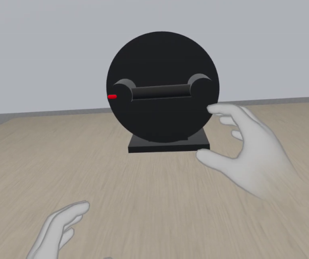

## 1. Background

We are testing how VR can be used to study differences in wrist movement in healthy individuals with forearm soreness following exercise. 

Taking part in the study requires attending two sessions, the first one remotely and the second one in presence. 

We will also need to send you a couple of questionnaires for you to complete and return them to us during the first session.

The first session involves taking part in a video call during which I will check that you are not experiencing any pain and then guide your through a simple wrist exercise with the purpose of making your forearm muscles sore the next day. For the second session, you will need to come to one of the University campuses, wear a virtual reality headset and turn a virtual handle using the handheld controllers provided.

You can find more information about the study [here](https://drive.google.com/file/d/19b18hgSGBHMhBVq5CqfDsDhtdmPawacw/view?usp=sharing) and the consent form [here](https://drive.google.com/file/d/1X9E3yNmLzaihJn1zI_BJ5ENexWx4W8Rt/view?usp=sharing).

## 2. Financial compensation available

By taking part in both sessions of the study, you will compensate you with £20.

## 3. Get in touch!

Contact us if you require more information or if you want to take part in the study and we can arrange the first session.

